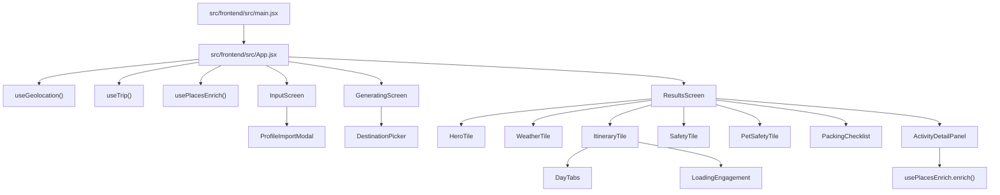
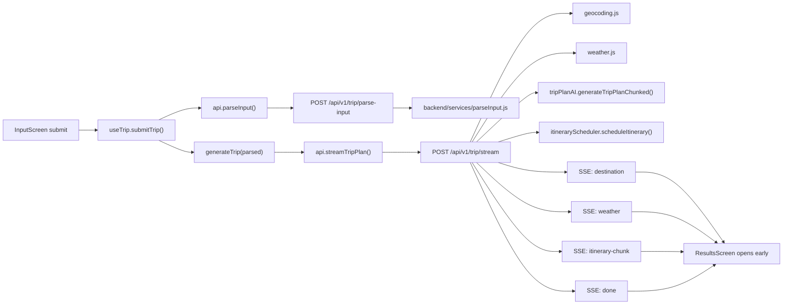
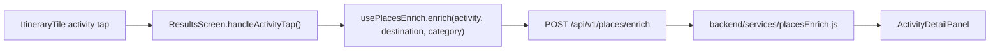
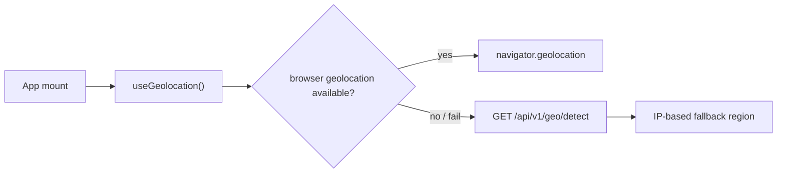
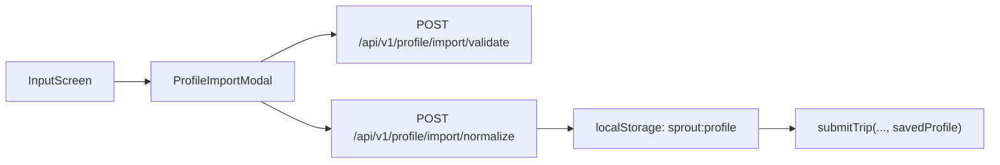
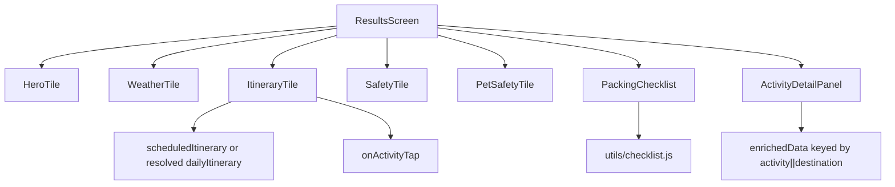
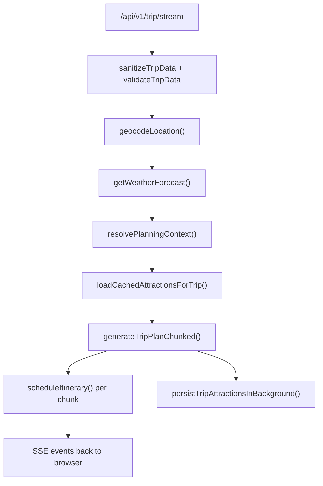

# SproutRoute Web Code Graph

This is the primary code graph for the **web app only**. Use it as the default orientation document before changing React screens, browser-side orchestration, or the Express routes that power the browser experience.

## Scope

Included:
- Vite/React SPA in `src/frontend/src`
- Express web API routes used by the SPA in `src/backend/server.js`
- Backend services directly on the web request path
- Shared contracts the web stack is converging toward in `src/shared/types`
- Tests that anchor the web flow

Excluded:
- Native iOS / Android work
- Ops dashboard internals
- Background scripts and migration details unless they affect the web path directly

## 1. Frontend Runtime Graph

## 2. Primary Browser Flow

### What owns the browser state

`src/frontend/src/hooks/useTrip.js` is the control plane for the SPA:
- owns screen transitions: `input -> generating -> results`
- owns persisted trip state via `utils/storage.js`
- drives the planning pipeline
- handles aborts, browser back-button behavior, and background fetches
- fans results out to `ResultsScreen`

If a change affects user-visible trip generation behavior, start in `useTrip.js` before changing presentation components.

## 3. Secondary Browser Flows

### Places enrichment

Notes:
- Enrichment is intentionally lazy and on-demand.
- The trip stream does not batch-enrich activities on the hot path.

### Geolocation bootstrap

### Profile import

Notes:
- Current web import flow is browser-local first.
- Auth-backed profile routes also exist, but `ProfileImportModal` currently saves to `localStorage`.

## 4. Results Composition Graph

`src/frontend/src/screens/ResultsScreen.jsx` is the presentation hub.

### Important result-screen boundaries

- `ResultsScreen` resolves itinerary shape differences from streamed and non-streamed payloads.
- `ItineraryTile` is the main itinerary renderer and progressive-loading surface.
- `PackingChecklist` owns packing progress, persisted checked state, custom items, and print behavior.
- `SafetyTile` and `PetSafetyTile` are fed by background API calls that should not block first results paint.

## 5. Frontend File Ownership Map

| Area | Primary files | Responsibility |
|---|---|---|
| App bootstrap | `src/frontend/src/main.jsx`, `src/frontend/src/App.jsx` | Mount app, choose screen, wire core hooks |
| Trip orchestration | `src/frontend/src/hooks/useTrip.js` | Parse input, start stream, handle retries/background fetches, persist trip state |
| Browser location | `src/frontend/src/hooks/useGeolocation.js` | GPS first, IP fallback |
| Activity enrichment | `src/frontend/src/hooks/usePlacesEnrich.js` | On-demand Places fetch + in-memory dedupe |
| API client | `src/frontend/src/services/api.js` | All HTTP/SSE calls, safe response parsing, retry logic |
| Input UI | `src/frontend/src/screens/InputScreen.jsx` | Free-text prompt, traveler tags, profile import launch |
| Generation UI | `src/frontend/src/screens/GeneratingScreen.jsx` | Progress screen + destination picker handoff |
| Results UI | `src/frontend/src/screens/ResultsScreen.jsx` | Tab shell and tile composition |
| Packing state | `src/frontend/src/components/PackingChecklist.jsx`, `src/frontend/src/utils/checklist.js` | Stable item IDs, progress, custom items, persistence |
| Browser persistence | `src/frontend/src/utils/storage.js` | Local/session storage helpers and keys |
| Analytics | `src/frontend/src/utils/analytics.js` | PostHog-style event emission boundaries |

## 6. Web API Route Graph

These are the backend routes that matter most to the browser flow today.

| Frontend caller | Route | Server role | Main service dependencies |
|---|---|---|---|
| `useGeolocation` | `GET /api/v1/geo/detect` | IP fallback location | external `ipapi`, request sanitization in `server.js` |
| `api.parseInput` | `POST /api/v1/trip/parse-input` | Parse natural language into trip intent | `services/parseInput.js`, reverse geocode context via Nominatim |
| `api.streamTripPlan` | `POST /api/v1/trip/stream` | Main web planning hot path via SSE | `geocoding.js`, `weather.js`, `tripPlanAI.js`, `itineraryScheduler.js`, `profileMerge.js`, `profileContext.js`, `attractionMemory.js` |
| `api.getTravelSafety` | `POST /api/safety/travel-tips` | Background general safety | `services/travelSafety.js` |
| `api.getCarSeatGuidance` | `POST /api/safety/car-seat-check` | Background car-seat guidance | `services/safetyRules.js`, `data/carSeatRules.js` |
| `api.petTravelCheck` | `POST /api/v1/safety/pet-travel-check` | Background pet travel guidance | `services/petSafety.js`, `data/petAirlineRules.js`, `data/petEntryRules.js` |
| `usePlacesEnrich` | `POST /api/v1/places/enrich` | Lazy activity detail enrichment | `services/placesEnrich.js` |
| `ProfileImportModal` | `POST /api/v1/profile/import/validate` | Validate pasted AI profile JSON | inline normalization/validation logic in `server.js` |
| `ProfileImportModal` | `POST /api/v1/profile/import/normalize` | Normalize external JSON into internal profile shape | inline normalization logic in `server.js` |

### Adjacent routes that exist but are not the main browser hot path

These matter when extending the web app, but they are not the default trip-generation flow right now:

| Route | Why it exists |
|---|---|
| `POST /api/v1/trip/plan` | Non-streamed v1 planning response |
| `POST /api/v1/trip/bundle` | Single-call bundled plan + packing path, useful fallback/alternate client path |
| `POST /api/v1/trip/packing` | Dedicated packing generation path |
| `POST /api/v1/trip/replan` | Activity-driven itinerary regeneration with cached weather |
| `GET /api/v1/meta/capabilities` | Feature flags and platform capabilities |
| `GET/PUT/DELETE /api/v1/profile/me` | Auth-backed profile persistence |
| `GET /api/v1/safety/travel-advisory/:countryCode` | International advisory data |
| `GET /api/v1/safety/neighborhood` | Neighborhood safety lookup |

## 7. Backend Planning Pipeline

### Key server-side composition points

- `src/backend/server.js` is still the composition root for the web API.
- `resolvePlanningContext()` merges browser-supplied profile context with stored profile context.
- `generateTripPlanChunked()` is the long-trip planning engine used by the streamed route.
- `scheduleItinerary()` converts AI output into time-slotted itinerary structure for the UI.
- `createAttractionMemoryService()` is already in the path for cached planning candidates and background persistence.

## 8. Shared Contracts Boundary

The browser code is still JavaScript-first, but the intended contract boundary is in:

- `src/shared/types/trip.ts`
- `src/shared/types/api.ts`
- `src/shared/types/profile.ts`
- `src/shared/types/pet.ts`

Practical rule:
- If you change any request/response shape used by `/api/v1/*`, update the shared types even if the current React code does not import them yet.

## 9. Test Graph For The Web App

| Test layer | Files | What they anchor |
|---|---|---|
| Frontend API reliability | `tests/unit/apiFetch.test.js` | retry logic, safe parsing, failure behavior in `services/api.js` |
| Input parsing | `tests/unit/parseInput.test.js` | natural-language parsing behavior |
| Safety services | `tests/unit/safetyRules.test.js`, `tests/unit/petSafety.test.js`, `tests/unit/petAirlineRules.test.js`, `tests/unit/petEntryRules.test.js`, `tests/unit/intlSafetyRules.test.js` | safety outputs the web UI depends on |
| Packing behavior | `tests/unit/checklist.test.js`, `tests/unit/deterministicPacking.test.js`, `tests/unit/packingListAI.test.js` | stable item IDs and packing generation |
| Route contracts | `tests/integration/api.integration.test.js`, `tests/integration/apiV1.contract.test.js` | Express route wiring and v1 response shapes |
| Browser UX | `tests/e2e/flows/*.spec.ts`, `tests/e2e/tiles/*.spec.ts`, `tests/e2e/screens/*.spec.ts` | full web flow, tile rendering, loading states, production smoke |

## 10. Change Impact Guide

Use this section to choose the smallest correct starting point.

| If you need to change... | Start here first | Then inspect |
|---|---|---|
| Trip generation sequence or screen transitions | `src/frontend/src/hooks/useTrip.js` | `src/frontend/src/services/api.js`, `src/backend/server.js` |
| A screen layout or tile composition | `src/frontend/src/screens/ResultsScreen.jsx` | individual tile component files |
| Input behavior or traveler/profile capture | `src/frontend/src/screens/InputScreen.jsx` | `ProfileImportModal.jsx`, `useTrip.js`, `parse-input` route |
| API retry/failure behavior | `src/frontend/src/services/api.js` | `tests/unit/apiFetch.test.js` |
| SSE event semantics | `src/backend/server.js` route `/api/v1/trip/stream` | `useTrip.js`, `ResultsScreen.jsx`, `tripPlanAI.js` |
| Packing UI state bugs | `PackingChecklist.jsx` | `utils/checklist.js`, `tests/unit/checklist.test.js` |
| Safety tile data | relevant backend route in `server.js` | `travelSafety.js`, `safetyRules.js`, `petSafety.js` |
| Place detail enrichment | `usePlacesEnrich.js` | `/api/v1/places/enrich`, `placesEnrich.js`, `ActivityDetailPanel.jsx` |

## 11. Current Web Hot Path Summary

If you only remember one chain, remember this:

`main.jsx -> App.jsx -> useTrip.submitTrip() -> /api/v1/trip/parse-input -> /api/v1/trip/stream -> ResultsScreen -> ItineraryTile / SafetyTile / PackingChecklist / ActivityDetailPanel`

That is the web app’s primary spine.
